# MERN Task Management System

A full-stack task management application built with the **MERN stack** (MongoDB, Express.js, React, and Node.js), featuring secure authentication, task management, file attachments, dashboard statistics, search and filtering, administrative user management, password recovery, and production deployment through IIS.

---

## 🚀 Features

### 📋 Task Management

* Create tasks
* View task details
* Edit tasks
* Delete tasks
* Task status management
* Task priority management
* Due date management
* Detailed task descriptions
* User-specific task ownership
* Search tasks
* Filter tasks by status and priority
* Server-side pagination
* Responsive task management interface

### 📊 Dashboard

The dashboard provides an overview of the authenticated user's tasks.

* Total task statistics
* To Do task count
* In Progress task count
* Completed task count
* Priority overview
* User-specific statistics
* Responsive dashboard layout

### 📎 File Attachments

The application provides flexible task attachment management with support for **multiple file uploads** and **custom filenames**.

#### Multiple File Upload

Users can select and upload **multiple files in a single operation**, making it easy to attach several documents, images, reports, or other supporting files to a task.

#### Custom File Names

Before uploading, users can **change the filename of each selected attachment**.

For example:

```text
Selected Files

📄 project-report.pdf
   → Project Report September.pdf

📊 statistics.xlsx
   → Task Statistics.xlsx

🖼️ dashboard.png
   → Dashboard Screenshot.png
```

This allows users to give uploaded files meaningful and descriptive names instead of keeping the original filenames.

#### Attachment Features

* 📁 Multiple files can be selected at once
* ✏️ Filename can be customized before upload
* 📎 Multiple attachments can be associated with a single task
* 📦 Maximum file size: **10 MB per file**
* 🔐 File access is protected by authentication
* 👤 Users can only access attachments belonging to their own tasks
* 🗂️ File extensions are preserved
* 🚀 Multipart file upload
* 🛡️ Uploaded files are excluded from the Git repository

### 🔐 Authentication & Security

* User registration
* User login
* JWT-based authentication
* HTTP-only authentication cookies
* Password hashing using bcrypt
* Protected API routes
* User account status validation
* Logout functionality
* Expired-session handling
* Forgot-password functionality
* Email-based password recovery
* Time-limited password reset tokens
* Password reset token invalidation
* Change password functionality
* Password validation
* Authentication rate limiting
* User/task ownership validation

### 👨‍💼 Administration

The application includes role-based administrative functionality.

* Administrator authentication
* Admin-only protected routes
* User management
* User role management
* User account status management
* Account suspension/reactivation
* Role-based authorization

Example users:

```text
System Administrator
John Developer
Sarah Analyst
```

---

## 🛠️ Technology Stack

### Frontend

* React
* Vite
* JavaScript (ES6+)
* HTML5
* CSS3
* React Hooks
* Lucide React

### Backend

* Node.js
* Express.js
* REST API
* JWT
* bcrypt
* Multer
* Nodemailer
* ExcelJS
* Cookie-based authentication

### Database

* MongoDB Atlas
* Mongoose

### Development & Deployment

* Git
* GitHub
* Microsoft IIS
* IIS URL Rewrite
* Application Request Routing (ARR)
* NSSM
* Node.js Windows Service

---

## 🏗️ Application Architecture

```text
                         Browser
                            │
                            ▼
                   ┌─────────────────┐
                   │       IIS       │
                   │ React Frontend  │
                   └────────┬────────┘
                            │
                   /TaskManagement/api
                            │
                            ▼
                   ┌─────────────────┐
                   │ IIS URL Rewrite │
                   │      + ARR      │
                   └────────┬────────┘
                            │
                            ▼
                   ┌─────────────────┐
                   │    Node.js API  │
                   │    Express.js   │
                   └────────┬────────┘
                            │
                            ▼
                   ┌─────────────────┐
                   │  MongoDB Atlas  │
                   └─────────────────┘
```

---

## 📁 Project Structure

```text
mern-task-management/
│
├── client/
│   ├── public/
│   ├── src/
│   │   ├── components/
│   │   │   ├── admin/
│   │   │   └── auth/
│   │   ├── App.jsx
│   │   ├── App.css
│   │   ├── index.css
│   │   └── main.jsx
│   ├── package.json
│   └── vite.config.js
│
├── server/
│   ├── middleware/
│   │   ├── adminMiddleware.js
│   │   └── authMiddleware.js
│   │
│   ├── models/
│   │   ├── Task.js
│   │   ├── UploadedFile.js
│   │   └── user.js
│   │
│   ├── routes/
│   │   ├── adminRoutes.js
│   │   ├── authRoutes.js
│   │   ├── fileRoutes.js
│   │   └── taskRoutes.js
│   │
│   ├── uploads/
│   ├── server.js
│   └── package.json
│
├── screenshots/
│   ├── dashboard.png
│   ├── task_management.png
│   ├── task_list.png
│   ├── task_list_function.png
│   ├── task_detail.png
│   ├── search_filters.png
│   ├── create_task.png
│   ├── admin_user_management.png
│   ├── login.png
│   ├── register.png
│   └── forgot_password.png
│
├── .gitignore
└── README.md
```

> The `server/uploads/` directory is used for application file uploads and is excluded from the Git repository.

---

## 🔐 Security

Security and authorization are core parts of the application.

### Authentication Security

* JWT authentication
* HTTP-only cookies
* Password hashing with bcrypt
* Protected API routes
* Authentication rate limiting
* Session and expired-token handling
* Secure password reset tokens
* Password reset token expiration
* Reset-token invalidation after successful password reset

### Authorization

Users can only access resources that belong to them.

Task operations are restricted using the authenticated user's ID.

This prevents users from:

* Viewing another user's tasks
* Editing another user's tasks
* Deleting another user's tasks
* Viewing another user's statistics
* Accessing another user's attachments

### Administrative Security

Administrative endpoints are protected by role-based authorization.

Only authorized administrators can access administrative user-management functionality.

---

## 👤 User Isolation

Each task is associated with its authenticated owner.

```text
User A
  │
  ├── Task 1
  ├── Task 2
  └── Task 3

User B
  │
  ├── Task 4
  ├── Task 5
  └── Task 6
```

User A cannot access User B's tasks through the application API.

The ownership model is also applied to:

* Task creation
* Task updates
* Task deletion
* Dashboard statistics
* File attachments

---

## 🔑 Password Recovery

The application includes a complete password recovery workflow.

```text
Forgot Password
       │
       ▼
Enter Email Address
       │
       ▼
Reset Email
       │
       ▼
Time-Limited Reset Token
       │
       ▼
Create New Password
       │
       ▼
Token Invalidated
       │
       ▼
Login With New Password
```

Password recovery uses SMTP email delivery and time-limited reset tokens.

Sensitive email credentials are stored in environment variables and are not committed to GitHub.

---

## 📎 Attachment Workflow

```text
Select Multiple Files
        │
        ▼
Review Selected Files
        │
        ▼
Customize File Names
        │
        ▼
Upload Files
        │
        ▼
Associate With Task
        │
        ▼
Protected Attachment Access
```

This workflow allows users to organize task attachments with meaningful filenames while supporting multiple files in a single upload operation.

---

## 🔎 Search, Filtering & Pagination

The Task Management interface supports:

* Task title search
* Status filtering
* Priority filtering
* Server-side pagination
* Task list navigation

The filtering and pagination parameters are processed through the backend API.

---

## 📊 Dashboard Statistics

The dashboard provides user-specific statistics including:

| Statistic         | Description                                 |
| ----------------- | ------------------------------------------- |
| Total Tasks       | Total tasks owned by the authenticated user |
| To Do             | Tasks that have not started                 |
| In Progress       | Tasks currently being worked on             |
| Completed         | Finished tasks                              |
| Priority Overview | Distribution of task priorities             |

Statistics are restricted to the authenticated user's tasks.

---

## 👨‍💼 Administration

The administrative interface provides protected user-management functionality.

Administrators can manage application users and their account status.

Example roles:

| User                 | Role  | Status |
| -------------------- | ----- | ------ |
| System Administrator | Admin | Active |
| John Developer       | User  | Active |
| Sarah Analyst        | User  | Active |

---

## 🌐 Production Deployment

The application has been deployed on Windows using **IIS** as the frontend web server and reverse proxy.

### Production Architecture

```text
                    IIS
                     │
        ┌────────────┴────────────┐
        │                         │
        ▼                         ▼
 /TaskManagement/        /TaskManagement/api/
        │                         │
        ▼                         ▼
 React Production Build     IIS URL Rewrite
                                  │
                                  ▼
                           Node.js :5000
                                  │
                                  ▼
                           MongoDB Atlas
```

### Node.js Service

The backend Node.js application runs as a Windows service using **NSSM (Non-Sucking Service Manager)**.

This allows the API to:

* Start automatically with Windows
* Run continuously in the background
* Restart independently from the frontend
* Operate without requiring a terminal window

---

## ⚙️ Environment Variables

Sensitive configuration is stored in environment files and excluded from Git.

### Server Environment

Create:

```text
server/.env
```

Example:

```env
MONGO_URI=your_mongodb_atlas_connection_string
JWT_SECRET=your_jwt_secret
CLIENT_URL=http://your-server-address

EMAIL_USER=your_email_address
EMAIL_PASS=your_email_app_password
SMTP_HOST=smtp.example.com
SMTP_PORT=587
```

### Client Environment

Create:

```text
client/.env
```

Example:

```env
VITE_API_URL=/TaskManagement/api
```

> Never commit real passwords, API keys, database credentials, JWT secrets, SMTP credentials, or other sensitive configuration to GitHub.

---

## 🧪 Testing & Validation

The application has been tested for:

### Authentication

* User registration
* Login
* Logout
* Expired authentication
* Forgot password
* Password reset
* Change password

### Authorization

* User isolation
* Task ownership
* Create/update/delete ownership
* Admin authorization
* Account status handling

### Files

* Multiple file upload
* Custom filename handling
* Attachment ownership
* Protected attachment access
* 10 MB maximum file size per file

### Application

* CRUD operations
* Search
* Filtering
* Pagination
* Dashboard statistics
* MongoDB Atlas connectivity
* REST API functionality
* Responsive UI

### Production

* IIS hosting
* IIS URL Rewrite
* ARR reverse proxy
* Node.js Windows service
* Automatic service startup
* Production React build

---

# 📸 Screenshots

The following screenshots demonstrate the main features and user interfaces of the application.

## 📊 Dashboard

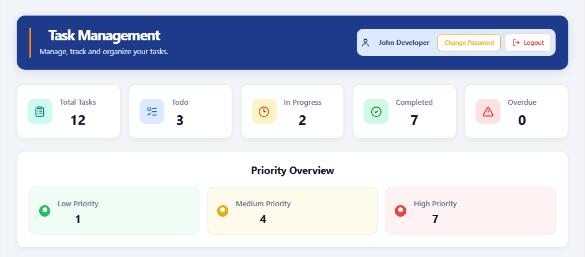

---

## 📋 Task Management

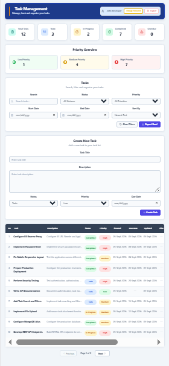

---

## 📝 Task List

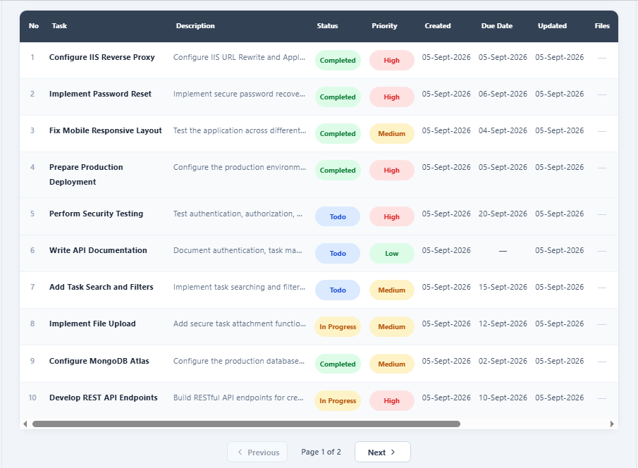

### Task List Functions

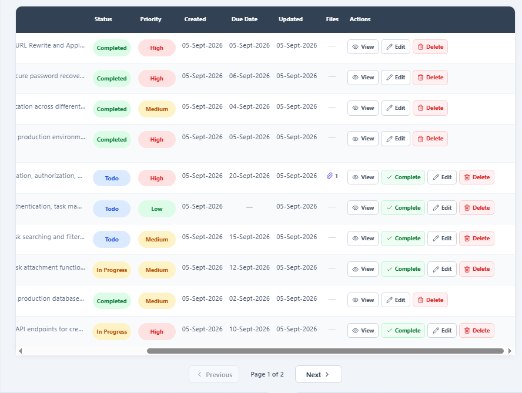

---

## 🔎 Search & Filters

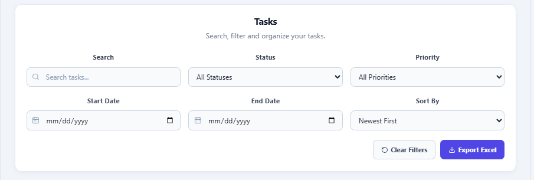

---

## ➕ Create Task

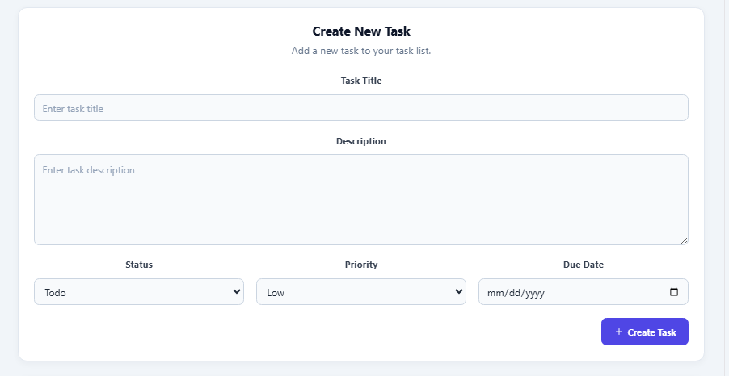

---

## 📄 Task Detail & Attachments

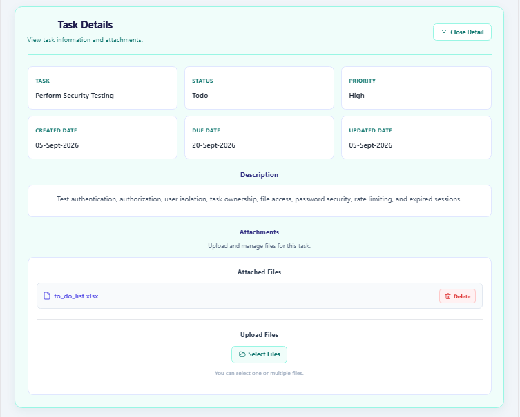

---

## 👨‍💼 Admin User Management

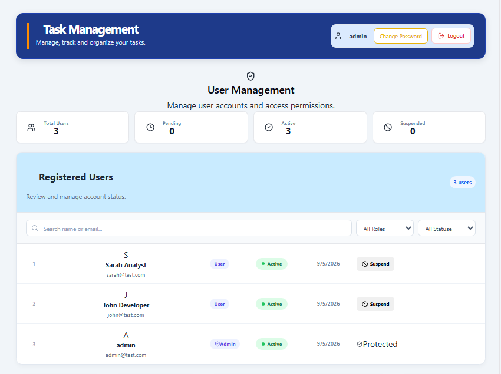

---

## 🔐 Login

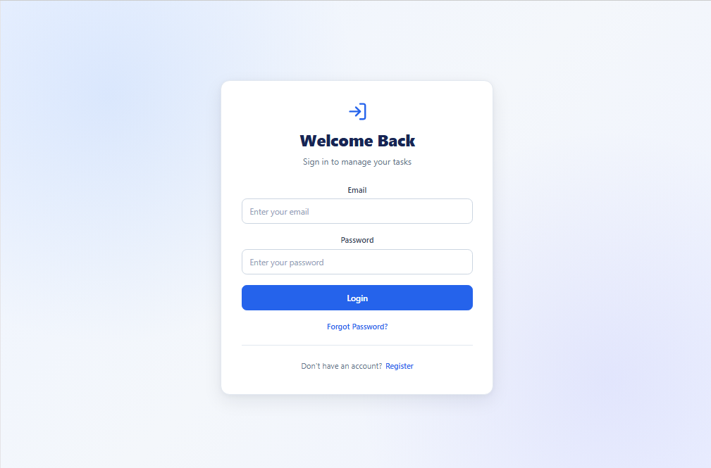

---

## 📝 Register

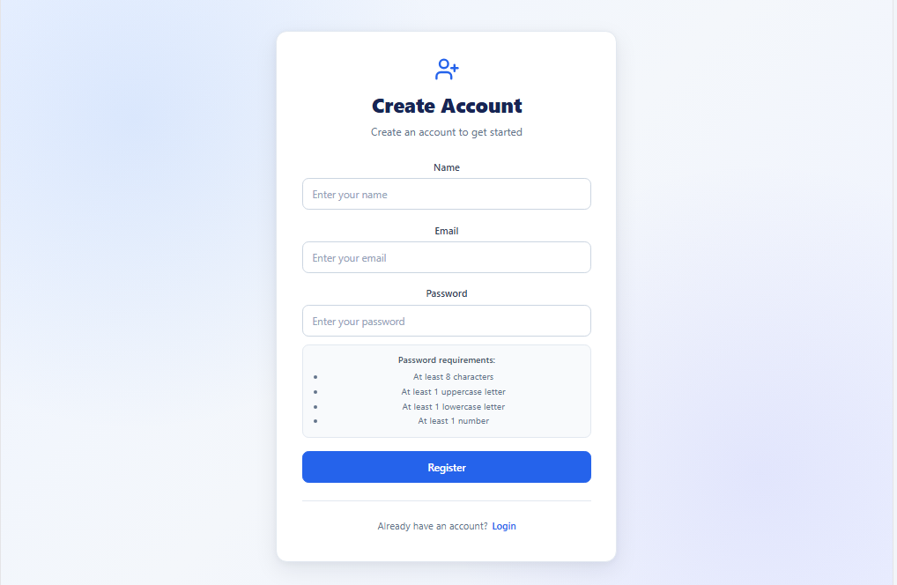

---

## 🔑 Forgot Password

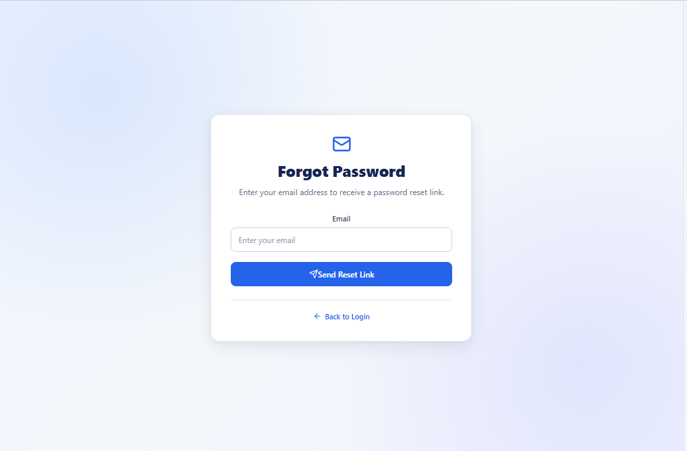

---

## 🚀 Local Development

### 1. Clone the Repository

```bash
git clone https://github.com/hnlxyz/mern-task-management.git
cd mern-task-management
```

### 2. Install Backend Dependencies

```bash
cd server
npm install
```

### 3. Configure Backend Environment

Create:

```text
server/.env
```

Configure the required:

* MongoDB Atlas connection
* JWT secret
* Client URL
* SMTP settings

### 4. Install Frontend Dependencies

```bash
cd ../client
npm install
```

Create:

```text
client/.env
```

Configure:

```env
VITE_API_URL=/TaskManagement/api
```

### 5. Run the Backend

From the `server` directory:

```bash
npm start
```

### 6. Run the Frontend

From the `client` directory:

```bash
npm run dev
```

The Vite development server will provide the local frontend URL.

---

## 🏭 Production Build

To create the React production build:

```bash
cd client
npm run build
```

The generated files are placed in:

```text
client/dist/
```

The production build can then be deployed through IIS.

---

## 📌 Project Highlights

This project demonstrates practical full-stack development skills across the complete application lifecycle.

### Frontend

* React application development
* Responsive UI
* React Hooks
* Search and filtering
* Pagination
* Form handling
* Multiple file upload interface
* Custom filename handling

### Backend

* Node.js
* Express.js
* REST API development
* Authentication middleware
* Authorization middleware
* File upload handling
* Email integration
* Password recovery

### Database

* MongoDB Atlas
* Mongoose
* Data relationships
* User ownership
* Task persistence

### Security

* JWT authentication
* HTTP-only cookies
* bcrypt password hashing
* Role-based authorization
* User isolation
* Resource ownership
* Password reset security
* Rate limiting

### Deployment

* IIS
* URL Rewrite
* ARR reverse proxy
* Node.js Windows service
* NSSM
* MongoDB Atlas

---

## 📚 Key Learning Areas

This project was developed to strengthen practical experience with:

* MERN stack development
* Full-stack application architecture
* REST API design
* Authentication and authorization
* Secure password management
* File upload systems
* MongoDB data modeling
* React frontend development
* Production deployment
* IIS reverse proxy configuration
* Windows service deployment
* Application security testing

---

## 👨‍💻 Author

**Htun Naing Lynn**

GitHub: https://github.com/hnlxyz

LinkedIn: https://www.linkedin.com/in/htun-naing-lynn-67871a14/

---

## 📄 License

This project is intended for **portfolio and educational purposes**.
